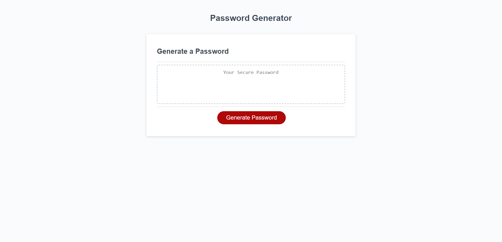
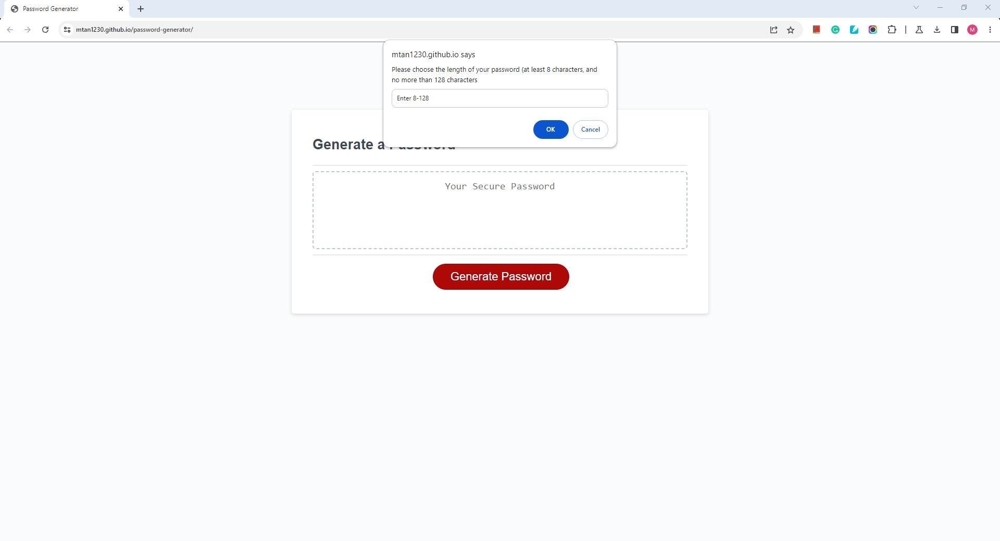
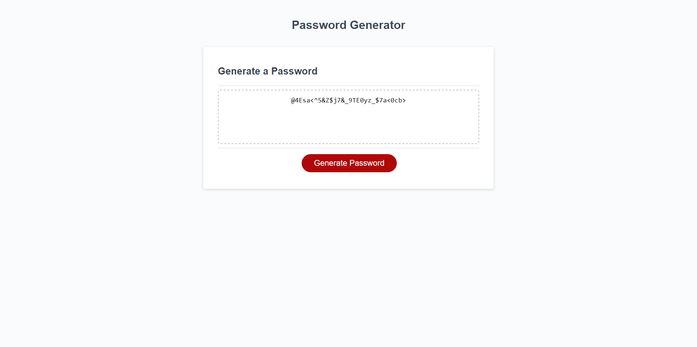

# Password Generator

  ## Description

  This application is used to randomly generate a strong password between 8 and 128 characters.  
  
  ## Usage
  
  When the user clicks the button, then the browser will prompt user to select below criteria:
  * length of the password
  * character types to include
    * lowercase
    * uppercase
    * numeric
    * and/or special characters  
  
  When all prompts are answered, then the password is presented on the page.

  ## Links  

  Page published at https://mtan1230.github.io/password-generator/

  ## Screenshots

    
    
  

  ## Credits  
  Base code developed and provided by Columbia Coding Bootcamp.